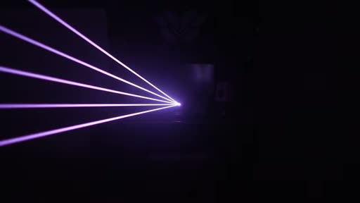
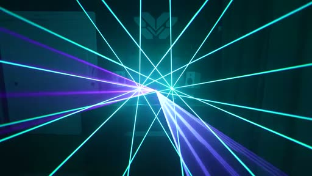
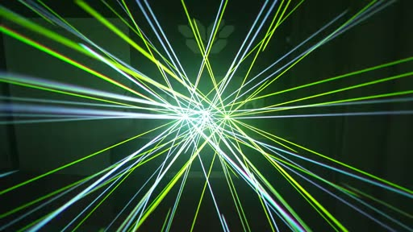
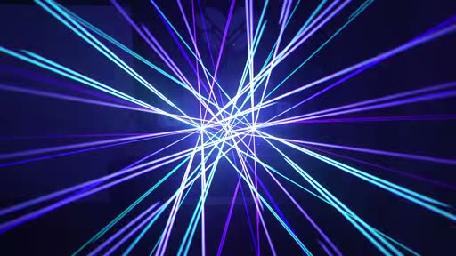
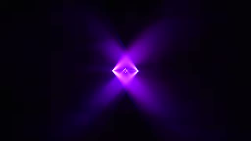

# Video Analysis — INZO "Overthinker" Laser Show (the thesis)

Part of the docs/lightshow series — see [00-README](00-README.md). Pair this with the [02-domain-primer](02-domain-primer.md) for the physics and protocols behind what you're seeing, the [04-proposals](04-proposals.md) for how it maps to a build, and the [07-visual-and-tech-catalog](07-visual-and-tech-catalog.md) for the concrete geometric vocabulary we extract from it.

---

This document is the centerpiece of the thesis. Everything downstream — the engine architecture, the AI choreographer, the geometric catalog — is an answer to one question: **what makes the reference show feel world-class, and how do we reproduce that feeling on an LED wall or projector instead of a galvo?** The reference is [INZO – "Overthinker" (Unofficial 4K Laser Show)](https://www.youtube.com/watch?v=UVaobBtZU2w) by Vox Daemon, 4:27 runtime. The analysis below is grounded in 80 exported frames plus the captions/transcript, watched end-to-end.

The headline finding, stated up front so the rest reads as evidence: **the show's "sharpness" is not a rendering property. It is an editing decision.** The beams are crisp because galvos draw razor lines — but the show is *world-class* because it fires hard on the transient and then gets out of the way. Restraint, not density, is the craft. An engine that reacts to everything will smear the structure into mush no matter how good its bloom is.

---

## What the video actually is (and why it matters)

This is a recording of **real RGB galvanometer laser projectors** — not a screen render, not a Notch comp, not After Effects. The evidence is unambiguous across the frames: roughly two desk-mounted projector units are visible, the room is hazed (you can see the volumetric beam cones, not just terminal dots on a surface), and the "Vox Daemon" eagle logo is mounted on the back wall behind the rig. This is a **desk-rig capture**, not an arena install — a caveat that matters for how we read scale and negative space (more below).

Why does the laser-vs-screen distinction matter for a project whose output target is explicitly **LED wall / projection only, no physical lasers**?

Because the thing we are stealing is the *look*, and the look is a consequence of how galvos work:

- **Galvos draw, they don't fill.** A galvanometer scanner steers a single beam with mirrors at ~30,000–65,000 points per second. There is no raster, no pixel grid. The "image" is a *path*, traced so fast that **persistence of vision** in the eye (and the camera sensor) fuses the moving dot into a continuous solid line. See the domain primer's treatment of [the galvo/POV model](02-domain-primer.md).
- **That is why the edge is razor-sharp.** A real beam has no antialiasing because there is nothing to alias — it's the actual scattering of coherent light off haze particles along a mathematically straight segment. An LED panel or projector *cannot* produce this for free: a 1-px line on a 1080p wall is soft, dim, and grid-locked.
- **Therefore our engine's hardest problem is faking the beam, not faking the choreography.** Reproducing "galvo crispness" on a raster device is a *rendering* challenge — additive blending, tight high-dynamic-range cores with controlled bloom falloff, sub-pixel line geometry, disciplined black levels. This is exactly the missing **vector/geometry render layer** called out for [Proposal A](04-proposals.md), and it's why we author beams as a SceneGraph of normalized lines/polygons rather than as shader noise. The [visual catalog](07-visual-and-tech-catalog.md) breaks down the additive-core-plus-bloom recipe.

Two more honest caveats before the walkthrough:

1. **"Unofficial" / fan-made.** This is a laserist's interpretation of the INZO track, not an official music video. That's *good* for us — it means the choreography is one talented operator's reading of the song, which is precisely the editorial judgment we want to model and eventually automate.
2. **Desk-rig scale skews negative space.** On two small projectors in a single room, "negative space" reads partly as a hardware constraint (only so many beams to throw). In an arena the same restraint is a *choice*. We should read the show's restraint as intentional craft — and the timestamped evidence supports that, because the operator clearly *had* the beams to fill the frame during drops and chose not to during breakdowns.

---

## Section-by-section walkthrough

The track is melodic / future-bass, mid-tempo — commonly catalogued around **~150 BPM with a half-time drop feel** (treat the exact figure as approximate; we did not extract it from a master). Critically, the entire piece is built over **Alan Watts spoken-word samples** — the philosophy lecture is the emotional spine, and the laserist choreographs *to the words* as much as to the drums. That dual sync (to speech cadence *and* to the beat grid) is a subtle, high-value detail we'll want to reproduce.

### 0:00–0:18 — Intro / ambient: restraint as the opening statement

**Visuals.** One projector. A single **violet beam-fan** drifting slowly. This is the *maximum* negative-space state of the entire show — almost the whole frame is black, and the one gesture present is calm and unhurried. Geometry: a low-count fan (a handful of beams sharing an origin), wide angular spread, slow precession. Color is a single cool hue. There is no symmetry trick, no tunnel, no burst — the restraint *is* the composition.

**Audio.** Ambient intro, no kick yet. The Watts sample sets the thesis of the track: *"a person who thinks all the time has nothing to think about except thoughts…"* — fittingly, the visual is a single "thought," isolated. Low spectral energy, mostly pad/atmosphere; no transients to react to.

**Sync model.** Because there are no drums, there is nothing for a rhythmic or transient layer to do — and the show *correctly does nothing rhythmic*. The only motion is a slow drift mapped to the pad's swell, i.e. the **structural** layer only. This is the single most important frame in the whole analysis: it proves that *the absence of reaction is itself a designed state*. An always-on visualizer fails here.

### 0:18–0:30 — Sub + percussion enters: density ramps with energy

**Visuals.** Sub-bass and percussion arrive, and **green vertical beams join** the violet. Beam count goes up; a **starburst** begins to form (radial spokes from a common center). The new color (green) enters *with* the new instrument — color is being used as a layer identity, not decoration. Negative space contracts but is not yet gone.

**Audio.** First sustained sub, first percussive hits. Frequency content broadens from pad-only into low-end + transient highs. Tempo becomes legible here — the percussion establishes the grid the rest of the show will lock to.

**Sync model.** Two layers now active: the **structural** layer adds a color + a pattern family (starburst) as the section changes, and the **rhythmic** layer begins — beam count and scan motion start to pulse on the beat. Transients are present but the cuts are still soft; the operator is saving the hard transient hits for the drop.

### 0:30–0:55 — First build / drop: beam-matrix tunnels, symmetric starbursts, a red accent

**Visuals.** The first real drop. Full **beam-matrix tunnels** (parallel beams forming a perspective corridor) plus **symmetric starbursts**. A **red 6-beam accent** lands on a section marker — red appears almost nowhere else, so its arrival is unmistakably a *punctuation mark* on structure. The frame fills; symmetry (mirror / radial) does a lot of the visual work, because a symmetric pattern reads as "designed" even at high density.

**Audio.** Drop energy: full-spectrum, kick + sub + lead synth. The section marker the red lands on is a structural downbeat, not a random kick.

**Sync model.** All three layers fire together for the first time. **Structural:** palette + pattern family flip to "drop." **Rhythmic:** scan speed and beam count pulse on the BPM grid. **Transient:** the red 6-beam accent is a sharp, single-shot cut on one specific hit — color used as a transient *and* structural cue simultaneously. The perceived tightness comes from that red being instantaneous and then *gone*.

### 0:55–1:23 — Breakdown: the "breath"

**Visuals.** Energy deliberately pulled back. The field **splits into a cyan top-fan and a violet bottom-fan** — two calm gestures occupying opposite halves of the frame, reading as an inhale/exhale. Density drops hard; negative space returns. The split-complementary color pairing (cyan / violet) is cool and restful by design.

**Audio.** Breakdown — drums thin out or drop away, pads return. The Watts sample lands the line *"this is the beginning of meditation"* — and the visual literally becomes a breathing exercise. This is the clearest evidence in the show that the operator is choreographing **to the spoken word**, not just the beat.

**Sync model.** Back to mostly the **structural** layer, with gentle rhythmic motion. The transient layer goes quiet — there's little to hit. The key craft move: the operator *spends* the energy they accumulated in the drop by going quiet, so the next drop hits harder. Dynamics are managed across sections, not just within them.

### 1:23–2:40 — Main drops: densest multicolor, BPM-locked pulsing

**Visuals.** The densest passages of the show: multicolor **starbursts in green + blue + yellow**, full beam-matrices, tunnels. Scan speed and beam count visibly **pulse on the BPM grid**, and the **hue cycles per phrase** (4- or 8-bar color arcs rather than per-beat color flicker). Even at peak density the patterns stay *symmetric*, which is what keeps it from collapsing into noise. Negative space is at its minimum here — and that's *correct*, because energy is at its maximum. Density follows energy, monotonically.

**Audio.** Peak-energy drops, full spectrum. The Watts "tangible wealth" / money sample runs roughly **1:53–2:10**, threading the philosophy back through the loudest part of the track. Tempo is fully established; the grid is rock-solid.

**Sync model.** All three layers at full tilt, but still *layered, not merged*. **Structural:** hue arcs and pattern family hold across each phrase. **Rhythmic:** the beam-count / scan-speed pulse is the dominant visible motion and it's locked to the beat. **Transient:** sharp flashes on kicks/snares ride on top of the rhythmic pulse. The reason this stays legible at max density is that each layer operates on a *different timescale* — phrase, beat, and hit — so the eye can parse them simultaneously. This is the single most important structural insight of the whole show; see the next section.

### 2:50–2:57 — Pre-final tension: iris close, then blackout

**Visuals.** The aperture **irises closed to a single point**, then **full blackout**. The frame collapses from a wide field to one dot to nothing. This is the most aggressive negative-space gesture in the show and it is *composed* — the blackout is a beat, not an outage.

**Audio.** Pre-final tension / riser into a silence or gap. The blackout aligns with a dramatic pause in the track.

**Sync model.** A **structural** cue executed as a hard transition: the engine deliberately renders *black*. This requires "blackout" to be a first-class, addressable state — something you cue, not something that happens when there's no input. An always-reactive system can never produce this on purpose. This is the canonical argument for a **cue/timeline** with explicit blackout events (see [Proposal A's show-control layer](04-proposals.md)).

### 3:00–3:50 — Rebuild: geometry over chaos

**Visuals.** Clean rebuild. Single-color **"V" beams** resolve into an evenly-spaced **radial sunburst** of spokes, slowly rotating. After the blackout, the show restarts from pure, legible geometry rather than chaos — the contrast with the dense drops is the whole point. Even spacing + slow rotation reads as *order*, a visual exhale after the iris-close tension.

**Audio.** Rebuild section. The Watts sample returns: *"…cannot be explained in words"* — and the visual answers with pure geometry, the thing words can't capture. Again, choreographed to the lecture.

**Sync model.** Predominantly **structural** (a new clean pattern family) plus slow **rhythmic** rotation tied to tempo. Transients are sparse and deliberate. The restraint here is what makes the *final* climax land.

### 4:00–4:21 — Final climax: two-source symmetric bursts

**Visuals.** Both projectors fire: **symmetric purple + green bursts** from two sources. This is the only sustained use of true two-source symmetry as a climax device — held back until the end so it reads as the biggest moment. Density high, but organized by the bilateral symmetry of the two rigs.

**Audio.** Final drop / climax — peak energy, full spectrum.

**Sync model.** All three layers, maxed, with the structural layer choosing the rarest, biggest gesture (two-source symmetry) for the peak. The show has been *saving* its most expensive move.

### 4:24 — Hard blackout on the last hit. End.

**Visuals / Audio / Sync.** A single hard cut to black on the final transient. The show ends on a **transient-gated blackout** — the last kick *is* the ending. No fade, no decay. The cut is the punctuation. This is the transient layer having the last word, and it's the cleanest possible demonstration that a hard, instantaneous cut on a single hit is the most powerful tool in the kit.

---

## The three-layer sync model (the key insight)

This is the load-bearing idea of the entire thesis. The reference show does not have "a" sync — it has **three layered syncs running on three different timescales simultaneously**, and the perceived quality comes from keeping them *separate* rather than collapsing them into one reactivity value.

| Layer | Timescale | What it drives | Reacts to | Failure mode if merged |
|---|---|---|---|---|
| **Structural** | Section / phrase (8–32 bars) | Color **palette** + **pattern family** (intro → build → drop → breakdown → rebuild → climax) | Song structure, section boundaries, the Watts lecture's cadence | Color/pattern flickers per-beat → no sense of "where we are" in the song |
| **Rhythmic** | Beat / bar (the BPM grid) | Scan motion, beam-count pulse, rotation speed | Tempo, downbeats | If pinned to structure → feels static; if pinned to transients → jittery |
| **Transient** | Single hit (sub-frame) | Sharp cuts, flashes, single-shot accents (the red 6-beam) | Individual kicks, snares, claps | If smeared into rhythmic → loses the "snap"; this is where "sharpness" lives |

Three consequences fall directly out of this table:

1. **"Sharpness/fidelity" is mostly the transient layer being tight + the negative space being disciplined.** Fire hard on the hit, then get out of the way. The crispness people praise is a *timing* property — the cut happens within a frame or two of the transient and then fully releases — not a resolution property.
2. **Each layer needs a different latency budget.** The structural layer can be planned *ahead of time* (you know the section map before the show); the rhythmic layer can use beat-tracking with look-ahead; only the transient layer must be **sub-frame**. Makinect already has the right primitive for this: the spectral-flux **onset** boolean in `Makinect/Visualizations/AudioEngine.swift` runs on the audio render thread at ~1–2 frames of latency, which is the sub-frame path. ML beat-trackers at ~100–200 ms are *too slow* for the transient layer (see [02-domain-primer](02-domain-primer.md) on latency truth) but are fine for the rhythmic/structural layers, which is exactly the architecture split [Proposal C / the hybrid D](04-proposals.md) is built around.
3. **The layers must be addressable independently in the engine.** This is the design pressure that pushes us toward a **cue/score** (planned structural + rhythmic layers) *plus* a **live reactive overlay** (transient layer) — the AI-choreographer-plus-DSP-performer split. The AI plans layers 1 and 2 offline into an editable score; the deterministic engine performs it; live onsets add layer 3 on top.

If you take one thing from this document into the engine design: **expose three reactivity channels, not one `audioReactivity` knob.** The existing single knob in `Makinect/Visualizations/VisualizationCommonParams.swift` is the right idea at the wrong granularity for a light show.

---

## Negative space and restraint

The amateur instinct is "more beams = more impressive." The reference show proves the opposite: **its most powerful moments are its emptiest ones** — the single violet fan at 0:01, the cyan/violet breath at 0:55, the iris-close-to-black at 2:54. Negative space is not the absence of content; it is content. Three principles:

- **Density follows energy, monotonically.** Map the *amount* of stuff on screen to the song's energy envelope. Empty in the intro, maximal in the drops, empty again in the breakdown. The show never violates this — every dense frame is a high-energy moment and every sparse frame is a low-energy one. This is a single, cheap, high-impact rule: drive a global "density" parameter from the audio energy/LUFS envelope (`AudioEngine.swift` already computes BS.1770 LUFS).
- **Blackout is a cue, not a gap.** The 2:54 iris-close and the 4:24 final cut are the two most dramatic moments and both are *black*. The engine must be able to render nothing *on purpose*, as a first-class timeline event. The existing panic / scene infra in `Makinect/MKAppState.swift` is a starting point, but blackout needs to be a *musical* cue, not just an emergency.
- **Spend energy to earn the next drop.** The breakdown at 0:55 exists so the 1:23 drop hits harder. Dynamics are a cross-section budget. An always-on visualizer has no concept of "saving up," which is why it plateaus and bores.

The desk-rig caveat applies here too: some emptiness is hardware-limited, not chosen. But the *timing* of the emptiness — pulled back exactly at breakdowns, slammed full exactly at drops — is unambiguously editorial. That editorial timing is what we automate.

---

## Design principles we will steal

Concrete, implementable takeaways that feed directly into the engine ([Proposal A](04-proposals.md) for the render/show-control layer, [Proposal C/D](04-proposals.md) for the scoring split, [07-visual-and-tech-catalog](07-visual-and-tech-catalog.md) for the geometry):

1. **Three independent sync channels, not one knob.** Replace the single `audioReactivity` with structural (section/phrase), rhythmic (beat grid), and transient (onset) channels, each with its own latency budget and its own mapping. This is the architectural spine.
2. **Section-driven palette + pattern family.** Color and pattern *family* change on section boundaries and hold for the whole section. Color is identity, not noise — green = "the percussion layer," red = "this is a section marker." Drive this from a structure map (offline AI score) rather than per-frame audio.
3. **Transient-gated flashes (the sharpness).** Sharp, single-shot accents fire on individual onsets via the sub-frame spectral-flux path in `AudioEngine.swift`, then fully release. Snap on, snap off — never a sustained reaction. This is where perceived fidelity comes from.
4. **Blackout as a first-class cue.** "Render nothing" is an addressable timeline event with a clean hard cut, used at tension peaks and at the end. Build iris-close (collapse-to-point) and hard-cut variants.
5. **Density follows energy, monotonically.** A single global density/beam-count parameter driven from the LUFS/energy envelope. Empty when quiet, full when loud. Cheap, high-impact, never violated.
6. **Spend energy to earn drops.** Manage dynamics *across* sections — force the engine quiet in breakdowns so drops land. Encode this in the score as an energy curve, not just instantaneous reactivity.
7. **Symmetry buys legibility at high density.** Mirror / radial / bilateral (two-source) symmetry keeps dense frames from reading as chaos. Make symmetry a render-cheap, score-selectable property of every pattern.
8. **Hue cycles per phrase, not per beat.** Color arcs over 4–8 bars. Per-beat color flicker reads as noise; phrase-length hue arcs read as intention. Tie hue to the structural/rhythmic layers, never to transients.
9. **Geometry over chaos on rebuilds.** After a blackout/tension peak, restart from pure, evenly-spaced, slowly-rotating geometry (sunburst spokes, clean "V"s). The contrast with the dense drops is the payoff.
10. **Choreograph to the spoken word, not just the beat.** The breakdown breathes on *"the beginning of meditation"*; the rebuild answers *"cannot be explained in words"* with pure geometry. The AI scorer should ingest lyrics/transcript and align structural cues to semantic/speech cadence, not only the drum grid — this is a genuine differentiator (`PoseDetector.swift` + an offline transcript pass feed the same score).
11. **The crisp-beam look is a render problem, solved once.** Reproducing galvo sharpness on a raster device = additive blending + tight HDR cores + controlled bloom + sub-pixel line geometry, built as the vector/geometry SceneGraph layer. Solve it once in the render layer and every pattern inherits it. See [07-visual-and-tech-catalog](07-visual-and-tech-catalog.md).
12. **Plan layers 1–2 offline, perform layer 3 live.** The structural and rhythmic layers are knowable before the show and belong in an editable score (AI choreographer); only the transient layer must run in the live <10 ms loop. This is the hybrid product thesis in one sentence.

---

## Sources

- INZO – "Overthinker" (Unofficial 4K Laser Show) by Vox Daemon — the reference video (watched: 80 frames + captions transcript): <https://www.youtube.com/watch?v=UVaobBtZU2w>
- Makinect audio brain (spectral-flux onset, BPM, LUFS, chromagram): `Makinect/Visualizations/AudioEngine.swift`
- Makinect universal control knobs (`audioReactivity` et al.): `Makinect/Visualizations/VisualizationCommonParams.swift`
- Makinect show/scene infra (scenes, panic, tap-tempo): `Makinect/MKAppState.swift`
- Kinect/Vision pose input for body-driven choreography: `Makinect/PoseDetector.swift`
- Latency, galvo/POV physics, DMX/Art-Net, and protocol grounding: [02-domain-primer](02-domain-primer.md)
- Engine/product direction (Proposals A, C, and the chosen hybrid D): [04-proposals](04-proposals.md)
- Geometric vocabulary and the crisp-beam render recipe: [07-visual-and-tech-catalog](07-visual-and-tech-catalog.md)
